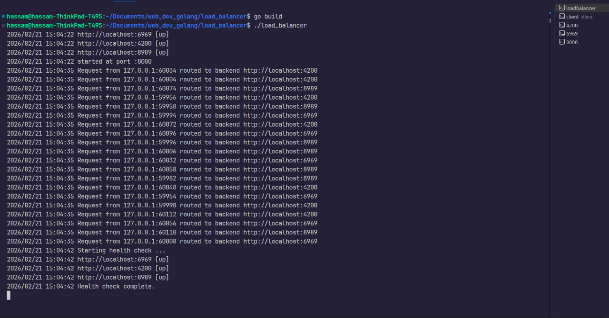
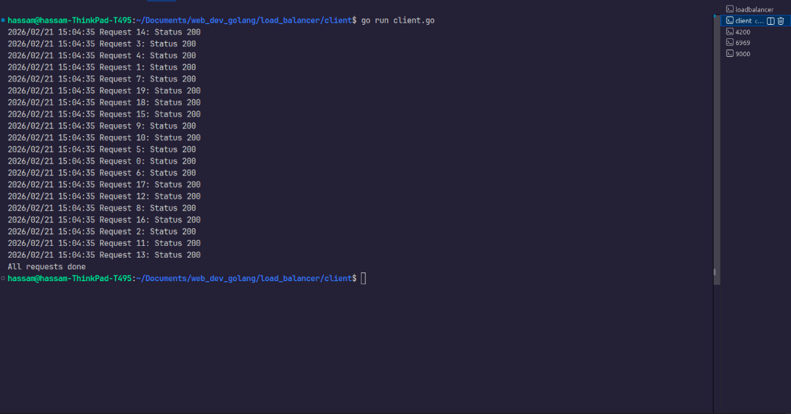

## About Project

 <p>A simple load balancer implemented in Go that distributes incoming requests to multiple backend servers using round-robin strategy.</p>
<p>I created this project because I wanted to explore how operating system concepts like synchronization, mutexes, wait groups, and goroutines (lightweight threads) can be applied in practice. It also helped me understand how a load balancer works to manage high traffic efficiently.</p>

## Load Balancing
<div>
    
</div>


## Client who sent 20 concurrent requests
<div>
    
</div>

## Setup

Clone the repository:

```bash
git clone https://github.com/yourusername/load-balancer.git
cd load-balancer
go mod tidy 
```

Before starting main.go start 3 backends servers at port 6969, 8989, 4200 using
```bash
go run testServer/server.go 6969

go run testServer/server.go 8989

go run testServer/server.go 4200
``` 

now run main file
```bash
go run main.go

```

to test load balancer send request using client
```bash
go run client/client.go
```


Must have
- Go 1.20+ installed
